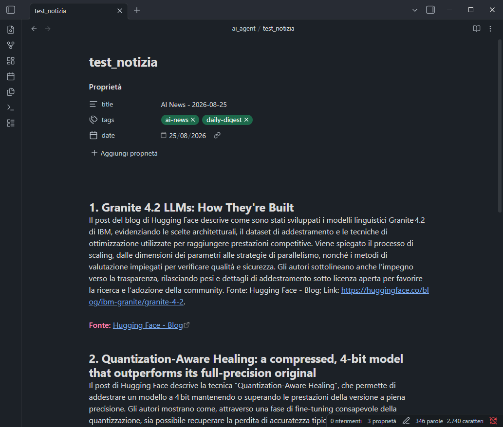
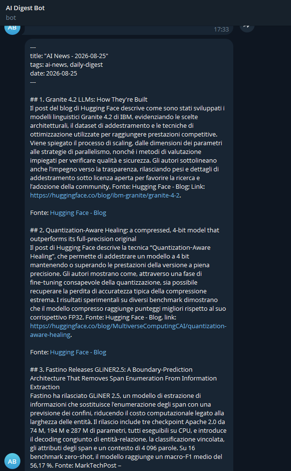
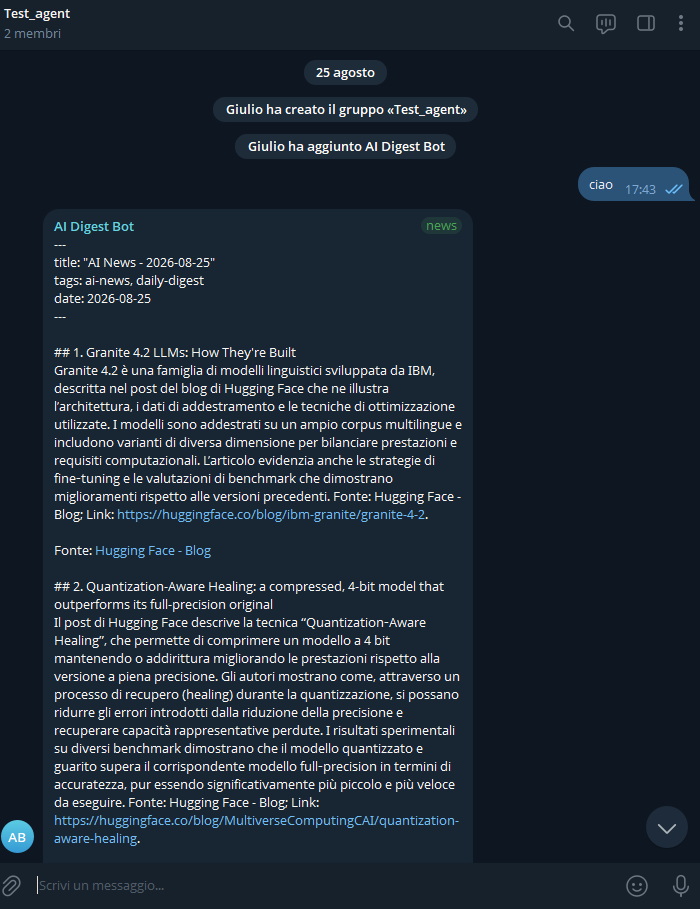
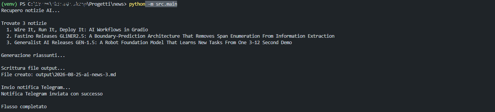

# AI News Agent


An autonomous Python agent that retrieves the latest artificial intelligence news from RSS feeds, generates Italian summaries using an LLM, and distributes them through Markdown files (Obsidian-compatible) and Telegram.

## Features

- **Automatic fetching**: Retrieves news from public RSS feeds (MarkTechPost, Hugging Face Blog, OpenAI News)
- **Source diversification**: A maximum of 2 articles per feed to prevent a single source from dominating the digest
- **LLM summarization**: Generates 3–5 sentence summaries in Italian using NVIDIA Nemotron 3 Super via OpenRouter
- **Multiple outputs**:
  - Markdown files with Obsidian-compatible YAML front matter
  - Telegram notifications (private chat + channel)
- **Modular architecture**: Fetching, summarization, and output are decoupled to make it easier to add new channels

## Project Structure

```text
project/
├── src/
│   ├── fetch_news.py       # Fetches news via RSS
│   ├── summarize.py        # Summarization via LLM (OpenRouter)
│   ├── output_writer.py    # Writes Markdown files
│   ├── notifiers/
│   │   ├── __init__.py
│   │   └── telegram.py     # Sends Telegram notifications
│   └── main.py             # Flow orchestration
├── output/                  # Generated Markdown files
├── tests/
├── .env                     # Environment variables (not versioned)
├── .env.example             # .env template
├── .gitignore
├── AGENTS.md                # Coding agent instructions
├── requirements.txt
└── README.md
```

## Installation

```bash
# Clone the repository
git clone https://github.com/ectorr01/ai-news-agent.git
cd ai-news-agent

# Create a virtual environment
python -m venv venv
source venv/bin/activate  # Linux/Mac
# or
venv\\Scripts\\activate  # Windows

# Install dependencies
pip install -r requirements.txt
```

## Configuration

1. Edit `.env` with your keys:
   ```env
   OPENROUTER_API_KEY=sk-or-v1-your_key
   TELEGRAM_BOT_TOKEN=1234567890:ABCdefGHIjklMNOpqrsTUVwxyz
   TELEGRAM_CHAT_ID=123456789
   TELEGRAM_CHANNEL_ID=-1001234567890
   ```

### How to Obtain the Keys

**OpenRouter API Key:**
- Go to [openrouter.ai](https://openrouter.ai)
- Create an account and generate an API key
- The model used is `nvidia/nemotron-3-super-120b-a12b:free` (free)

**Telegram Bot Token:**
- Search for `@BotFather` on Telegram
- Send `/newbot` and follow the instructions
- Copy the token provided to you

**Telegram Chat ID:**
- Search for your bot by username and start it with `/start`
- Use `@getidsbot` or visit `https://api.telegram.org/bot<YOUR_TOKEN>/getUpdates` to obtain your chat ID

**Telegram Channel ID:**
- Create a channel and add your bot as an administrator
- Use `@getidsbot` by forwarding a message from the channel, or use the channel username (e.g. `@my_channel`)

## Usage

```bash
# Activate the virtual environment
source venv/bin/activate  # Linux/Mac

# Run the agent
python -m src.main
```

The agent:
1. Retrieves the 3 latest AI news articles (maximum 2 per feed)
2. Generates Italian summaries using an LLM
3. Writes a Markdown file to `output/YYYY-MM-DD-ai-news.md`
4. Sends the digest to Telegram (private chat and channel)

## Output

### Markdown File (Obsidian)

Each run generates a file in `output/` with YAML front matter:

```markdown
---
title: "AI News - 2026-08-23"
tags: [ai-news, daily-digest]
date: 2026-08-23
---

## 1. News headline
A 3–5 sentence summary in Italian.
**Source:** [Source name](url)
```

### Telegram

A Markdown message containing the 3 summarized news articles and links to the sources, sent both to the private chat and to the configured channel.

## Screenshots

### Markdown Output (Obsidian)



### Telegram Notification in the Bot's Private Chat



### Telegram Notification in a Public Channel



### Terminal During Execution



## Dependencies

- `feedparser` – RSS feed parsing
- `openai` – OpenRouter-compatible client
- `python-dotenv` – Loads environment variables
- `requests` – Telegram API

See `requirements.txt` for the complete list.

## Notes

- Do not commit the `.env` file to Git (it contains sensitive API keys)
- The `output/` directory is ignored by Git (automatically generated files)
- The project follows the conventions defined in `AGENTS.md`

## License

MIT
